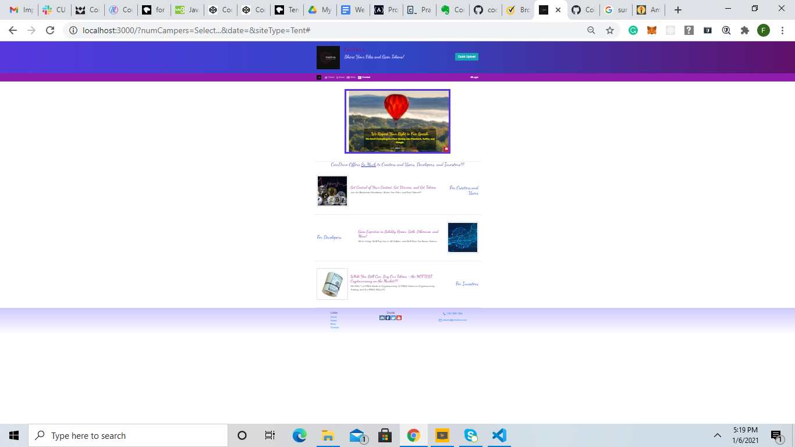
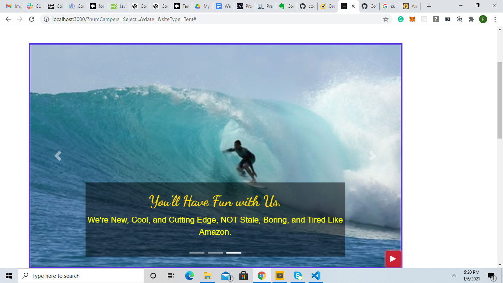
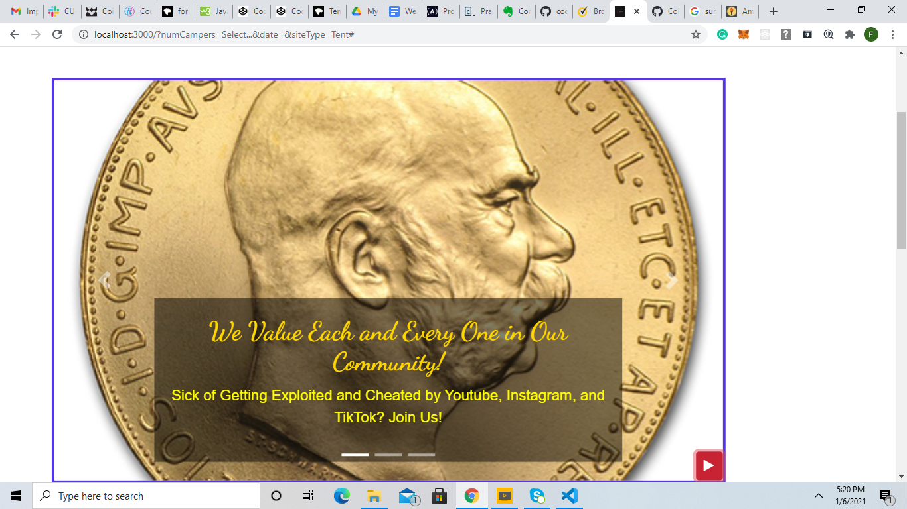
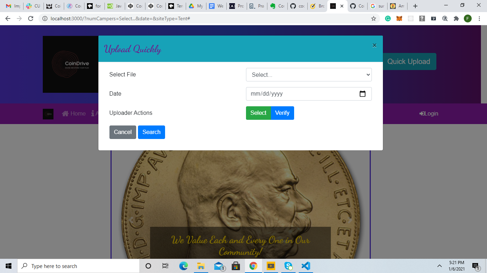
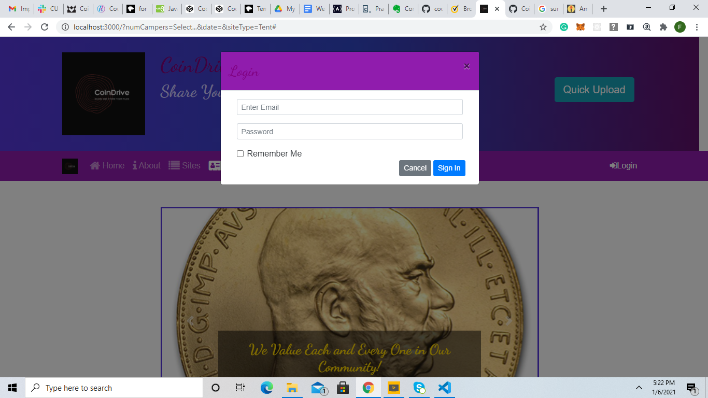

# CoinDrive_Site
website for coindrive

after git cloning, go to the desired directory and then enter a specific command on the desired directory prompt...

npm install
  
Then the user should enter another command...

npm start
  
  
  
  
The user should see the shots below, and also the user should see the CoinDrive logo on the tab...

  
